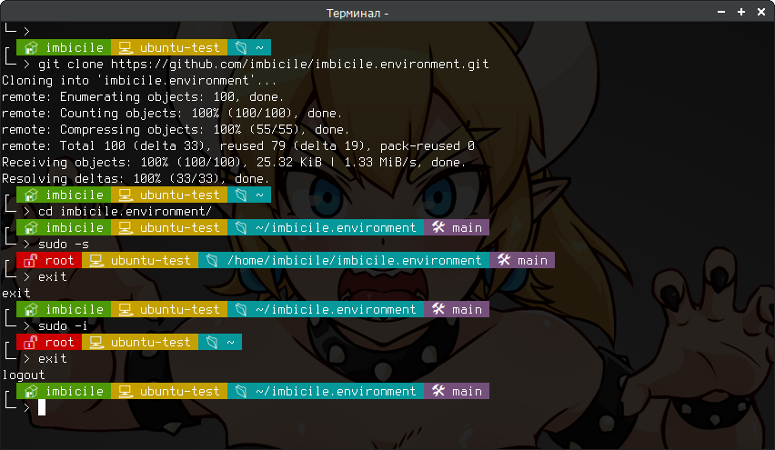

# Роль imbicile.environment

<div align="center">

<br><br>
</div>

## Информация

Установка окружения для root, текущих и новых пользователей

## Требования

Проверено на Ubuntu и Debian

## Переменные

```yml
# Вид строки bash
# Возможные варианты
# modern - стиль со значками без фона
# on_modern - стиль со значками с фоном
# simple - стиль без значков
# server - рекомендован для серверов

env_ps1_style: server
```

## Пример Server Playbook

```yml
---
- name: Server environment
  hosts:
    - all

  vars:
    env_ps1_style: server

  roles:
    - role: imbicile.environment
      become: true
      tags: env
```

## Пример Local Playbook

```yml
---
- name: Local env
  hosts: 127.0.0.1
  connection: local
  become: true

  vars:
    env_ps1_style: modern

  roles:
    - role: imbicile.environment
      tags: env
```

## Пример ansible.cfg

https://docs.ansible.com/ansible/2.4/intro_configuration.html

```yml
[defaults]
deprecation_warnings=false
host_key_checking = false
inventory = inventory
roles_path = roles
collections_path = collections
interpreter_python=/usr/bin/python3
ansible_python_interpreter=/usr/bin/python3
force_valid_group_names = ignore
callbacks_enabled=ansible.posix.profile_tasks, ansible.posix.timer
forks=30
gathering = smart
fact_caching = jsonfile
fact_caching_connection = cache/facts
fact_caching_timeout = 3600
internal_poll_interval = 0.001
ansible_managed = Ansible managed: modified on %d-%m-%Y %H:%M:%S
remote_tmp = /tmp
ansible_remote_tmp = /tmp

[callback_profile_tasks]
sort_order = none
task_output_limit = 500

[inventory]
cache = true
cache_plugin = jsonfile
cache_connection = cache/
cache_timeout = 300

[ssh_connection]
control_path = %(directory)s/%%C
retries = 2
ssh_args = -o ControlMaster=auto -o ControlPersist=60s
pipelining = true
scp_if_ssh=true
```

## Стуктура файлов

```bash
.
├── ansible.cfg
├── cache
│   └── facts
├── inventory
├── playbooks
│   ├── env.yml
└── roles
    └── imbicile.environment
```

## ! ПЕРДУПРЕЖДЕНИЕ !

**Роль ставит все необходимые пакеты**

При физической работе в консоли tty **специальные символны не отображаются**, поэтому не рекомендуется тема **on_modern** на физических серверах без графической оболочки

В теме **modern** реализовано переключение стиля на основе определения tty

## Author Information

https://imbicile.pp.ru
